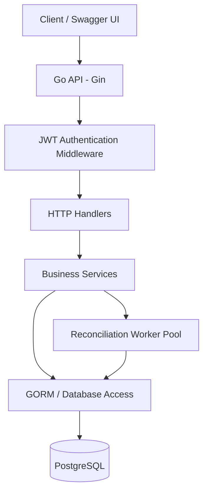

# Payment Processing & Reconciliation System

A backend-focused fintech project built with **Go, Gin, GORM, and PostgreSQL**. It simulates payment processing, records provider transaction attempts, imports provider reports, and reconciles external report data against internal payment records.

> **Note:** This is a simulated payment system for learning and demonstration. It does not move real money or connect to a live payment provider.

## Table of Contents

- [What is this project?](#what-is-this-project)
- [Why was it built?](#why-was-it-built)
- [Key features](#key-features)
- [How it works](#how-it-works)
- [Architecture](#architecture)
- [Technology stack](#technology-stack)
- [Project structure](#project-structure)
- [Database design](#database-design)
- [Run locally](#run-locally)
  - [Prerequisites](#prerequisites)
  - [Run with Docker Compose](#run-with-docker-compose)
  - [Run without Docker](#run-without-docker)
- [Environment variables](#environment-variables)
- [API documentation](#api-documentation)
- [Typical workflow](#typical-workflow)
- [Concurrency and consistency](#concurrency-and-consistency)
- [Deployment](#deployment)
- [Future improvements](#future-improvements)

## What is this project?

The Payment Processing & Reconciliation System is a REST API that models important backend workflows found in fintech platforms.

It allows an authenticated user to create a payment request, process a simulated provider outcome, and track payment records. It also supports importing simulated provider reports and running reconciliation jobs to identify differences between internal records and provider-reported transactions.

The project focuses on backend engineering concerns such as:

- Data integrity and database transactions
- Idempotent payment requests
- Authentication and authorization
- Concurrent processing with goroutines and workers
- Background job execution
- Reconciliation and mismatch detection
- API documentation and containerized deployment

## Why was it built?

Payment systems must keep internal records consistent with the results reported by payment providers. In distributed systems, a request can be retried, a response can be delayed, or provider data can differ from internal records.

This project was built to explore how a backend can handle these situations in a controlled simulation.

### Problems modeled

- **Duplicate requests:** Repeated requests should not create duplicate payment operations when the same idempotency key is reused.
- **Partial database updates:** Related changes should commit together or roll back together.
- **Provider outcome tracking:** Provider attempts should be recorded separately from the main payment record.
- **Report discrepancies:** Provider report entries may be missing internally, have a different amount, or have a different status.
- **Long-running work:** Reconciliation can be processed in the background instead of keeping an HTTP request open until all rows are checked.

## Key features

- User registration and login with password hashing and JWT authentication
- Protected API routes using middleware
- Payment creation with amount validation
- Idempotency key support
- Simulated successful and failed payment outcomes
- Provider transaction and attempt records
- PostgreSQL transactions with commit and rollback behavior
- Provider report import
- Reconciliation jobs and reconciliation result records
- Detection of matched and discrepant records
- Background processing using goroutines and a worker pool
- Context cancellation and controlled worker shutdown
- Swagger UI / OpenAPI documentation
- Dockerfile and Docker Compose for local containerized development
- Deployment using Render and Neon PostgreSQL

## How it works

### Payment processing flow

1. A user registers or logs in and receives a JWT.
2. The authenticated user submits a payment request with an amount and idempotency key.
3. The API validates the request and stores the payment.
4. A simulated provider outcome is submitted as success or failure.
5. The service updates the relevant payment and provider transaction records using a database transaction.
6. If the database operations succeed, GORM commits the transaction. If an operation returns an error, GORM rolls it back.

### Reconciliation flow

1. An authenticated user imports a simulated provider report.
2. Report transactions are stored for later comparison.
3. A reconciliation request is created for a report.
4. A background worker processes the reconciliation job.
5. Each provider report entry is compared with internal payment/provider records according to the project's matching logic.
6. Reconciliation results are stored with the relevant match or discrepancy classification.
7. The job status and results can be inspected through the available API endpoints.

## Architecture



The handlers manage HTTP input and responses, services contain application logic, GORM handles database operations, and reconciliation workers process background jobs.

## Technology stack

| Area | Technology |
|---|---|
| Language | Go |
| HTTP framework | Gin |
| ORM | GORM |
| Database | PostgreSQL |
| Authentication | JWT |
| Password hashing | bcrypt |
| API documentation | Swaggo / Swagger UI |
| Concurrency | Goroutines, channels, worker pool, context |
| Containerization | Docker, Docker Compose |
| Deployment | Render |
| Managed database | Neon PostgreSQL |
| API testing | Postman and Swagger UI |

## Project structure

The tree below is a representative layout. Adjust names to match the exact folders in your repository.

```text
.
├── config/                 # Database connection and application configuration
├── dto/                    # Request and response data transfer objects
├── docs/                   # Generated Swagger documentation
├── handlers/               # Gin HTTP handlers
├── middleware/             # JWT authentication and request middleware
├── models/                 # GORM database models
├── repository/             # Database access layer, if used
├── routes/                 # Route registration
├── services/               # Payment, provider, auth, and reconciliation logic
├── workers/                # Background reconciliation worker pool
├── .env.example            # Example environment configuration (if included)
├── .gitignore
├── Dockerfile              # Application container build
├── docker-compose.yml      # Local application and database services
├── go.mod
├── go.sum
└── main.go                 # Application entry point and dependency wiring
```

Keep `.env` and real secrets out of Git. Commit an `.env.example` containing placeholder values only.

## Database design

The application uses PostgreSQL with these core tables (confirm names against your migrations):

| Table | Purpose |
|---|---|
| `users` | User accounts and roles |
| `payments` | Internal payment requests, amount, status, and idempotency data |
| `provider_transactions` | Simulated provider attempts and outcomes |
| `provider_report_transactions` | Imported provider report rows |
| `reconciliation_jobs` | Tracks reconciliation job execution |
| `reconciliation_results` | Stores matching and discrepancy outcomes |

Payment amounts use a fixed-precision numeric representation in PostgreSQL to avoid floating-point rounding issues for monetary values.

## Run locally

### Prerequisites

- Go version compatible with the project's `go.mod`
- Docker Desktop with Docker Compose, or a local PostgreSQL instance
- Git

### Run with Docker Compose

1. Clone the repository:

   ```bash
   git clone <YOUR_REPOSITORY_URL>
   cd <YOUR_PROJECT_DIRECTORY>
   ```

2. Create your local environment file from the example, if the project includes one:

   ```bash
   cp .env.example .env
   ```

   On Windows PowerShell:

   ```powershell
   Copy-Item .env.example .env
   ```

3. Set the required environment variables in `.env`. Use local development values and never commit secrets.

4. Build and start the application and database:

   ```bash
   docker compose up --build
   ```

5. Check the API:

   ```text
   http://localhost:8080
   ```

6. Open Swagger UI:

   ```text
   http://localhost:8080/swagger/index.html
   ```

Stop the containers:

```bash
docker compose down
```

To remove the local database volume as well (this deletes persisted local database data):

```bash
docker compose down -v
```

### Run without Docker

1. Start PostgreSQL and create a development database.
2. Configure `.env` with the local database connection and JWT secret.
3. Install dependencies:

   ```bash
   go mod download
   ```

4. Start the application:

   ```bash
   go run .
   ```

The server's default port and required configuration are determined by the application environment settings.

## Environment variables

Use the exact variable names expected by `config` in this repository. Common settings may include:

| Variable | Description | Example for local development |
|---|---|---|
| `PORT` | HTTP server port | `8080` |
| `DB_HOST` | PostgreSQL host | `localhost` when running Go directly; `postgres` when running inside the Compose network |
| `DB_PORT` | PostgreSQL port | `5433` from host if Compose maps `5433:5432`; `5432` inside Compose |
| `DB_USER` | Database username | `postgres` |
| `DB_PASSWORD` | Database password | Set locally; do not publish |
| `DB_NAME` | Database name | `payment_reconciliation` |
| `DB_SSLMODE` | PostgreSQL SSL mode | `disable` locally; `require` for a hosted database |
| `JWT_SECRET` | Secret used to sign JWTs | Use a long random local secret; never publish |

The names above are illustrative; retain the exact names used in your code. Do not place production credentials in this README, Git history, screenshots, or public issue reports.

## API documentation

Swagger UI is available when the application is running:

```text
http://localhost:8080/swagger/index.html
```

For the deployed service, use the Swagger URL on your Render domain.

Swagger documents the implemented endpoints, request schemas, responses, and JWT authorization scheme. For protected endpoints, obtain a token through the login endpoint and use the Swagger **Authorize** control with the expected `Bearer <token>` value.

## API Endpoints

Swagger UI: `/swagger/index.html` (local: `http://localhost:8080/swagger/index.html`).

| Method | Endpoint | Auth | Description |
|---|---|---|---|
| `GET` | `/api/auth/` | Public | API welcome message |
| `POST` | `/api/auth/register` | Public | Register user |
| `POST` | `/api/auth/login` | Public | Login and receive JWT |
| `POST` | `/api/payment/create` | JWT | Create payment with amount and idempotency key |
| `POST` | `/api/transaction/{id}/{change}` | JWT | Record simulated `success` or `fail` outcome |
| `POST` | `/api/provider/report` | JWT | Import simulated provider report |
| `POST` | `/api/reconcil/{report_id}` | JWT | Start reconciliation for a report |

### Example requests

**Login**
```json
{
  "email": "user@example.com",
  "password": "ChangeMe123!"
}
```

**Create payment** (confirm exact field names in Swagger)
```json
{
  "amount": "500.00",
  "idempotency_key": "PAY-DEMO-001"
}
```

**Process simulated outcome**
```http
POST /api/transaction/3/success
Authorization: Bearer <JWT>
```

**Start reconciliation**
```http
POST /api/reconcil/1
Authorization: Bearer <JWT>
```

Use the JWT from login in Swagger's **Authorize** dialog for protected endpoints. Request schemas, response fields, and exact status codes are documented in Swagger. The report-import body format depends on the handler's binding/DTO.

---

## Typical workflow

The exact paths and response fields are defined by the generated Swagger documentation. A typical end-to-end demonstration is:

1. Register a user.
2. Log in and copy the JWT.
3. Authorize Swagger with the JWT.
4. Create a payment using a valid amount and a unique idempotency key.
5. Submit a simulated provider outcome (`success` or `fail`) using the payment ID.
6. Import a simulated provider report.
7. Start reconciliation for the imported report ID.
8. Inspect the reconciliation job and stored results using the endpoints implemented in the project.

## Concurrency and consistency

- **GORM transactions:** Related database changes are grouped so that successful operations commit together and failed operations roll back.
- **Idempotency:** A unique idempotency key helps prevent duplicate payment creation for retried requests, subject to the application's implemented validation and database constraints.
- **Worker pool:** Reconciliation tasks are processed by background workers rather than requiring the client to wait for all report rows to be compared.
- **Context:** Cancellation and shutdown signals help stop background work in a controlled manner.

## Deployment

The project has been deployed using:

- **Render** for hosting the Go API
- **Neon PostgreSQL** for the managed PostgreSQL database
- **GitHub** as the source repository

Configure production environment variables through the hosting provider's environment settings. Keep credentials private. The first request to a free or sleeping web service may take longer while the instance starts.

## Future improvements

- Automated unit and integration test coverage
- Structured logging and centralized error handling
- Pagination and filtering for large result sets
- More detailed reconciliation reporting
- Metrics and health/readiness endpoints
- CI workflow for formatting, tests, and build checks

## Author

**Pavan Sonawane**

Computer Engineering | Backend & Full-Stack Development

- GitHub: <YOUR_GITHUB_PROFILE_URL>
- LinkedIn: <YOUR_LINKEDIN_PROFILE_URL>
